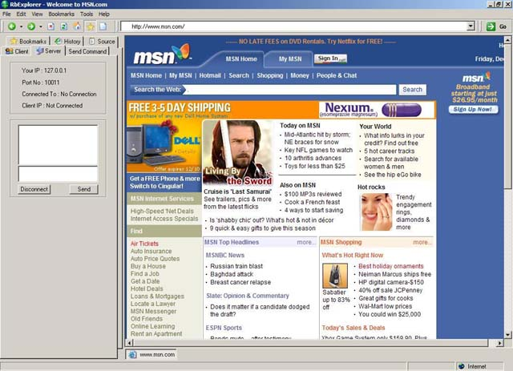



## RbExplorer

### Description

This is a good looking, powerful browser with many useful features. You can browse in several locations in a single window (like Opera browser). You can also make connections to other users and chat with them or execute some commands (like NavigateTo: To browser current page to a location, Messagebox: To show a message box and File Manager: To see remote computer's files and folders and download files). This is a code that you must see.
 
### More Info
 

             |
---                |---
**Submitted On**   |2003-12-05 19:04:18
**By**             |[Arbie Sarkissian](https://github.com/Planet-Source-Code/PSCIndex/blob/master/ByAuthor/arbie-sarkissian.md)
**Level**          |Advanced
**User Rating**    |4.5 (18 globes from 4 users)
**Compatibility**  |VB 6\.0
**Category**       |[OLE/ COM/ DCOM/ Active\-X](https://github.com/Planet-Source-Code/PSCIndex/blob/master/ByCategory/ole-com-dcom-active-x__1-29.md)
**World**          |[Visual Basic](https://github.com/Planet-Source-Code/PSCIndex/blob/master/ByWorld/visual-basic.md)
**Archive File**   |[RbExplorer1680951262003\.zip](https://github.com/Planet-Source-Code/arbie-sarkissian-rbexplorer__1-50347/archive/master.zip)

